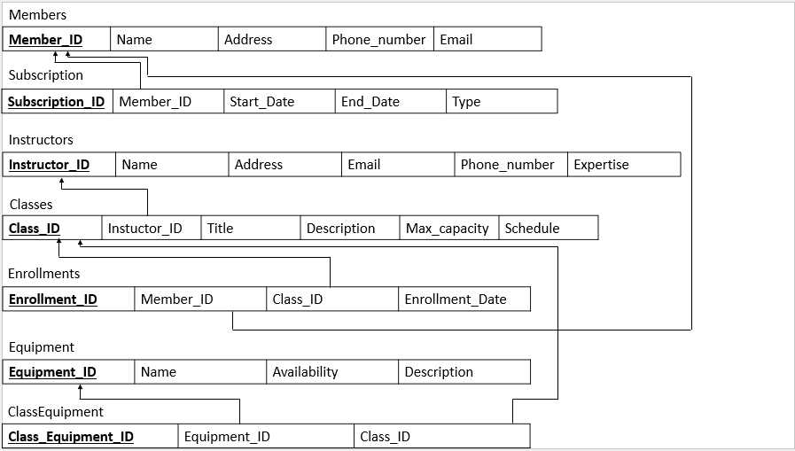

## Golden Fitness Gym Management System Database
- *Golden Fitness aims to develop a gym management database to enhance operational efficiency and improve member experience. This gym management database can efficiently manage member information, track class schedules, and monitor member subscriptions. The database provides valuable insights into member behavior and preferences, enabling the gym to make informed decisions regarding class offerings, instructor allocation, and membership plans. This database will empower Golden Fitness to provide a personalized and seamless fitness experience for its members while optimizing its operations.*

## Relational Mapping
- *This project outlines the steps needed to set up a relational database for managing gym operations, including member management, class schedules, instructor details, and equipment tracking.*
  

